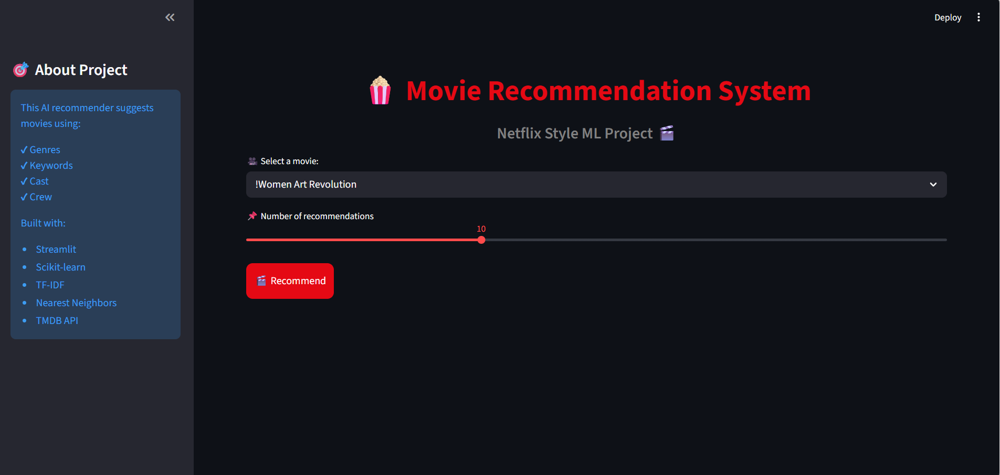
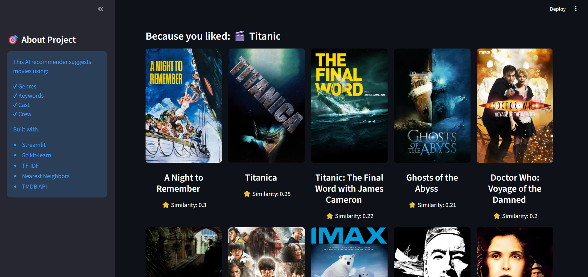

Here is the updated, more readable README — copy everything between the lines:

---

<div align="center">

# 🎬 Movie Recommendation System

### Find your next favorite movie using Machine Learning


<br>

> 🍿 Type a movie you love → Get 10 similar movies instantly — with posters, titles, and similarity scores.

<br>

[🚀 Live Demo](#) &nbsp;·&nbsp; [📁 Dataset](https://www.kaggle.com/datasets/rounakbanik/the-movies-dataset) &nbsp;·&nbsp; [🐛 Report Bug](#) &nbsp;·&nbsp; [⭐ Star this Repo](#)

</div>

---

<br>

## 🤔 What is this project?

Ever wondered how Netflix knows what to recommend next?

This project builds that system from scratch.

It analyzes **45,000+ movies** and finds the most similar ones based on:
- 📝 Plot overview
- 🎭 Genres
- 🔑 Keywords
- 🎬 Cast & Director

The result is a beautiful **Netflix-style web app** where you pick a movie and instantly get smart recommendations — complete with real movie posters pulled live from the internet.

<br>

---

## ✨ What Can It Do?

<br>

| 🔧 Feature | 💬 Description |
|---|---|
| 🎯 Smart Recommendations | Finds similar movies using TF-IDF + Cosine Similarity |
| 🖼️ Live Movie Posters | Fetches real posters from TMDB API automatically |
| 🎛️ You Control the Count | Choose between 5 and 20 recommendations using a slider |
| ⚡ Lightning Fast | Results appear instantly thanks to smart caching |
| 🎨 Netflix-Style Design | Beautiful red and black UI that feels familiar |
| 🔍 Flexible Search | Works even if you type part of the movie title |
| 📊 Similarity Score | See exactly how closely matched each recommendation is |

<br>

---

## 🛠️ Built With

<br>

```
🐍 Python 3.10          →  Core programming language
🤖 Scikit-learn         →  TF-IDF, Nearest Neighbors, Cosine Similarity
🐼 Pandas & NumPy       →  Data loading and processing
✂️  NLTK                →  Text stemming and cleaning
🌐 Streamlit            →  Web application framework
🎬 TMDB API             →  Live movie poster fetching
💾 Pickle               →  Saving and loading the model
📡 Requests             →  HTTP calls to the API
```

<br>

---

## 🧠 How Does the ML Work?

<br>

Think of it like this — every movie gets converted into a **bag of words** describing its personality. Then we find movies with the most similar personalities.

Here is the step-by-step pipeline:

<br>

```
📂 STEP 1 — Load Data
         3 CSV files: movies_metadata, keywords, credits
                          │
                          ▼
🧹 STEP 2 — Clean & Merge
         Fix bad IDs, drop nulls, join all 3 files
                          │
                          ▼
⚙️  STEP 3 — Feature Engineering
         Extract genres, keywords, top 3 cast, director
                          │
                          ▼
🏷️  STEP 4 — Build Tags
         genres × 3  +  keywords × 3  +  overview  +  cast  +  director
                          │
                          ▼
✂️  STEP 5 — Stemming
         "running" → "run" | "romantic" → "romanc"
                          │
                          ▼
📊 STEP 6 — TF-IDF Vectorization
         Convert text tags into numbers
                          │
                          ▼
📐 STEP 7 — Nearest Neighbors (Cosine Similarity)
         Find the closest matching movies
                          │
                          ▼
🎬 STEP 8 — Show Results in Streamlit App
```

<br>

> 💡 **Why repeat genres × 3?**
> So the model cares more about the movie's theme (Action, Romance, Drama)
> than about who acted in it. This gives much better recommendations.

<br>

---

## 📁 Project Structure

<br>

```
📦 movie-recommendation-system/
│
├── 📄 app.py               ← Streamlit web application
├── 📓 Movies.ipynb         ← Data processing & model building
├── 📋 requirements.txt     ← Python packages needed
├── 🚫 .gitignore           ← Files excluded from GitHub
├── 📖 README.md            ← You are here
│
└── 📸 screenshots/
    ├── home.png            ← App homepage screenshot
    └── results.png         ← Recommendations screenshot
```

<br>

---

## 🚀 Run It Yourself

<br>

### ① Clone the repository

```bash
git clone https://github.com/zeyadcode5656/movie-recommendation-system.git
cd movie-recommendation-system
```

<br>

### ② Install dependencies

```bash
pip install -r requirements.txt
```

<br>

### ③ Download the dataset from Kaggle

👉 [Click here to download](https://www.kaggle.com/datasets/rounakbanik/the-movies-dataset)

Place these 3 files in the project folder:

```
movies_metadata.csv
keywords.csv
credits.csv
```

<br>

### ④ Generate the model

Open `Movies.ipynb` and run all cells from top to bottom.
This creates the `movies.pkl` file that the app needs.

<br>

### ⑤ Launch the app

```bash
streamlit run app.py
```

Then open your browser at **http://localhost:8501** 🎉

<br>

---

## 🎮 How To Use

<br>

```
1. 🎥  Pick any movie from the dropdown list
2. 🎚️  Use the slider to choose how many recommendations you want
3. 🖱️  Click the big red "Recommend" button
4. 🍿  Enjoy your personalized movie list with posters!
```

<br>

---

## 💪 Challenges I Solved

<br>

### 🔴 Problem 1 — MemoryError on the Similarity Matrix

```
Computing similarity for 45,000 movies = a matrix of 2 BILLION numbers
That needs about 16GB of RAM — most computers crash immediately
```

✅ **Solution:** Switched from storing the full matrix to computing similarity
on-the-fly using `NearestNeighbors`. Fast, efficient, and works on any laptop.

<br>

### 🔴 Problem 2 — Deployment Crashes on Streamlit Cloud

```
The app worked perfectly on my computer but crashed when deployed online
The file paths were breaking in the cloud environment
```

✅ **Solution:** Used `os.path.abspath(__file__)` to build safe paths that work
everywhere — locally and in the cloud.

<br>

### 🔴 Problem 3 — Slow Loading on Large Dataset

```
45,000 movies take time to load and vectorize on every page refresh
```

✅ **Solution:** Added `@st.cache_resource` so the model loads once and stays
in memory. Repeat visits are now instant.

<br>

---

## 🔮 What I Want to Add Next

<br>

- [ ] 🤝 **Collaborative Filtering** — recommend based on what similar users watched
- [ ] 🔀 **Hybrid Recommender** — combine content + user behavior for better results
- [ ] 🎞️ **Movie Trailers** — embed YouTube trailers for each recommendation
- [ ] 📋 **Watchlist Feature** — let users save movies they want to watch
- [ ] 🔍 **Filter by Genre & Year** — narrow down recommendations further
- [ ] 🧠 **BERT Embeddings** — use deep learning for even smarter similarity

<br>

---

## 📸 Screenshots

<br>

| 🏠 Home Screen | 🎬 Recommendations |
|---|---|
|  |  |

<br>

---

## 🙏 Credits

<br>

| Resource | Purpose |
|---|---|
| [Kaggle Movies Dataset](https://www.kaggle.com/datasets/rounakbanik/the-movies-dataset) | Movie data source |
| [TMDB API](https://www.themoviedb.org/documentation/api) | Live movie posters |
| [Streamlit](https://streamlit.io/) | Web app framework |
| [Scikit-learn](https://scikit-learn.org/) | ML algorithms |

<br>

---

## 👨‍💻 About Me

<br>

Hi, I'm **Zeyad Sayed** — a beginner Machine Learning student who loves building real projects to learn faster than any course could teach.

🔗 [LinkedIn](https://www.linkedin.com/in/YOUR_LINKEDIN) &nbsp;·&nbsp; 🐙 [GitHub](https://github.com/zeyadcode5656)

<br>

---

<div align="center">

### If this project helped or inspired you, please give it a ⭐ — it means a lot!

<br>

*Built with ❤️ and a lot of debugging by Zeyad Sayed*

</div>

---
